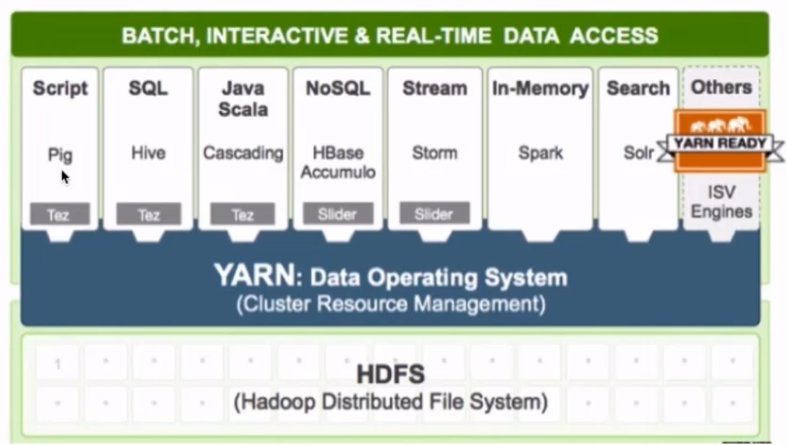

## Hadoop概述

课程目标：

- 知道Hadoop的概念及发展历史
- 说出hadoop的核心组件
- 知道hadoop的优势


### 1.1 什么是Hadoop

- Hadoop名字的由来

  - 作者：Doug cutting
  - Hadoop项目作者的孩子给一个棕黄色的大象样子的填充玩具的命名

  

- Hadoop的概念:

  - Apache™ Hadoop®  是一个开源的, **可靠的**(reliable), **可扩展**的(scalable)**分布式计算框架**
    - 允许使用简单的编程模型跨计算机集群分布式处理大型数据集
    - **可扩展**: 从单个服务器扩展到数千台计算机，每台计算机都提供本地计算和存储
    - **可靠的**: 不依靠硬件来提供高可用性(high-availability)，而是在应用层检测和处理故障，从而在计算机集群之上提供高可用服务

- Hadoop能做什么?

  - 搭建大型数据仓库

  - PB级数据的存储 处理 分析 统计等业务

    - 搜索引擎

    - 日志分析

    - 数据挖掘

    - 商业智能(Business Intelligence，简称：BI)

      ``` shell
      商业智能通常被理解为将企业中现有的数据(订单、库存、交易账目、客户和供应商等数据)转化为知识，帮助企业做出明智的业务经营决策的工具。从技术层面上讲，是数据仓库、数据挖掘等技术的综合运用。
      ```

- Hadoop发展史

  - 2003-2004年 Google发表了三篇论文

    - GFS：Google的分布式文件系统Google File System 
    - [MapReduce](https://en.wikipedia.org/wiki/MapReduce): Simplified Data Processing on Large Clusters 
    - BigTable：一个大型的分布式数据库
  - 2006年2月Hadoop成为Apache的独立开源项目( Doug Cutting等人实现了DFS和MapReduce机制)。
  - 2006年4月— 标准排序(10 GB每个节点)在188个节点上运行47.9个小时。 
  - 2008年4月— 赢得世界最快1TB数据排序在900个节点上用时209秒。 
  - 2008年— **淘宝开始投入研究基于Hadoop的系统–云梯**。云梯总容量约9.3PB，共有1100台机器，每天处理18000道作业，扫描500TB数据。 
  - 2009年3月— **Cloudera推出CDH（Cloudera’s Dsitribution Including Apache Hadoop）**
  - 2009年5月— Yahoo的团队使用Hadoop对1 TB的数据进行排序只花了62秒时间。 
  - 2009年7月— **Hadoop Core项目更名为Hadoop Common;** 
  - 2009年7月— **MapReduce和Hadoop Distributed File System (HDFS)成为Hadoop项目的独立子项目。**
  - 2012年11月— Apache Hadoop 1.0 Available
  - 2018年4月— Apache Hadoop 3.1 Available
  - 搜索引擎时代
    - 有保存大量网页的需求(单机  集群)
    - 词频统计 **【word count】**  **【PageRank】**
  - 数据仓库时代
    - FaceBook推出Hive（Hive是基于[Hadoop](https://baike.baidu.com/item/Hadoop/3526507)的一个[数据仓库](https://baike.baidu.com/item/数据仓库/381916)工具）
    - 曾经进行数分析与统计时, 仅限于数据库,受数据量和计算能力的限制, 我们只能对最重要的数据进行统计和分析(决策数据,财务相关)
    - Hive可以在Hadoop上运行SQL操作, 可以把运行日志, 应用采集数据,数据库数据放到一起分析
  - 数据挖掘时代
    - 啤酒尿不湿
    - 关联分析
    - 用户画像/物品画像
  - 机器学习时代  广义大数据
    - 大数据提高数据存储能力, 为机器学习提供燃料
    - alpha go
    - siri 小爱 天猫精灵


### 1.2 Hadoop核心组件 

- Hadoop是所有搜索引擎的共性问题的廉价解决方案
  - 如何存储持续增长的海量网页:  单节点 V.S. 分布式存储
  - 如何对持续增长的海量网页进行排序: 超算 V.S. 分布式计算
  - HDFS 解决分布式存储问题
  - MapReduce 解决分布式计算问题

- **Hadoop Common**: The common utilities that support the other Hadoop modules.(hadoop的公共组件)--（如将HDFS和MapReduce串起来）
- **Hadoop Distributed File System (HDFS™)**: A distributed file system that provides high-throughput access to application data.(分布式文件系统)
  - 源自于Google的GFS论文, 论文发表于2003年10月
  - HDFS是GFS的开源实现
  - HDFS的特点:扩展性&容错性&海量数量存储
  - 将文件切分成指定大小的数据块, 并在多台机器上保存多个副本（冗余、切割）
  - 数据切分、多副本、容错等操作对用户是透明的——系统自动给用户拆分
- 下面这张图是数据块多份复制存储的示意
  - 图中对于文件 /users/sameerp/data/part-0，其复制备份数设置为2, 存储的BlockID分别为1、3。
  - Block1的两个备份存储在DataNode0和DataNode2两个服务器上
  - Block3的两个备份存储在DataNode4和DataNode6两个服务器上


- **Hadoop MapReduce**: A YARN-based system for parallel processing of large data sets.

  - 分布式计算框架
  - 源于Google的MapReduce论文，论文发表于2004年12月
  - MapReduce是GoogleMapReduce的开源实现
  - MapReduce特点:扩展性&容错性&海量数据离线处理（得等）

  

- **Hadoop YARN**: A framework for job scheduling and cluster resource management.(资源调度系统)

  - YARN: Yet Another Resource Negotiator

  - 负责整个集群资源的管理和调度

  - YARN特点:扩展性&容错性&多框架资源统一调度

    


### 1.3 Hadoop优势

- 高可靠
  - 数据存储: 数据块多副本
  - 数据计算: 某个节点崩溃, 会自动重新调度作业计算
- 高扩展性
  - 存储/计算资源不够时，可以横向的线性扩展机器
  - 一个集群中可以包含数以千计的节点
  - 集群可以使用廉价机器，成本低
- Hadoop生态系统成熟
